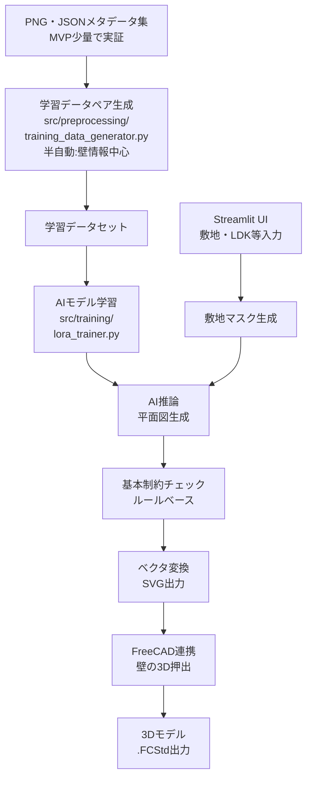

# 910mmグリッド住宅プラン自動生成システム

MacBook Pro (M4 Max) とUbuntu 22.04上で動作する、建築図面PDFを学習し910mm/455mm混合グリッドで住宅平面図を自動生成するMVP（Minimum Viable Product）システム。

## 📋 概要

- **目的**: 建築図面から寸法や特徴を抽出し、AIで新しい平面図を生成。
- **グリッド**: 910mm（本間）/ 455mm（半間）の日本建築標準寸法。
- **出力**: FreeCADで編集可能な基本的な3Dモデル（壁の押し出し）とSVG形式の2Dプラン。
- **処理時間目標**: 2秒以内/件（M4 Max環境想定）。
- **MVPの焦点**: データ処理パイプラインの半自動化（壁情報中心、少量PDFで検証）と、AIによる基本的な平面図生成からCAD出力までのコアパイプライン確立。

## 🏗️ システム構成



## 🚀 セットアップ

### 1. 環境準備（macOS）

```bash
cd ~/repos/floor_generate
brew install python@3.11 git cmake pkg-config poppler
# FreeCADは公式サイトから .app をダウンロードし、直接利用することを推奨
python3.11 -m venv floorplan_env
source floorplan_env/bin/activate
pip install --upgrade pip setuptools wheel
# PyTorch (M4 Max MPS対応の最新ナイトリー版推奨)
# 例: pip install --pre torch torchvision torchaudio --index-url https://download.pytorch.org/whl/nightly/cpu
pip install -r requirements.txt # PaddleOCR/PaddlePaddleも含む
chmod +x setup_dirs.sh
./setup_dirs.sh
```

### 1-2. 環境準備（Ubuntu 22.04）

```bash
cd ~/repos/floor_generate
sudo apt update
sudo apt install -y software-properties-common
sudo add-apt-repository ppa:deadsnakes/ppa -y
sudo apt update
sudo apt install -y python3.11 python3.11-venv python3.11-dev
sudo apt install -y poppler-utils cmake pkg-config git
python3.11 -m venv floorplan_env
source floorplan_env/bin/activate
pip install --upgrade pip setuptools wheel
# PyTorch (CPU/GPU版、最新ナイトリー版推奨)
# 例: pip install --pre torch torchvision torchaudio --index-url https://download.pytorch.org/whl/nightly/cpu
pip install -r requirements.txt # PaddleOCR/PaddlePaddleも含む
chmod +x setup_dirs.sh
./setup_dirs.sh
```

### 2. 依存関係の維持・更新（Maintain Dependencies）

```bash
cd ~/repos/floor_generate
source floorplan_env/bin/activate
pip install --upgrade pip setuptools wheel
# requirements.txt を更新する場合は注意して実行
# pip install -r requirements.txt --upgrade 
pip list --outdated
```

## 📁 プロジェクト構造

```
floor_generate/
├── data/
│   ├── raw_pdfs/        # 元PDF図面
│   ├── extracted/       # 寸法抽出結果
│   ├── normalized/      # グリッド正規化済み
│   ├── training/        # 学習用データ
│   └── validation/      # 検証用データ
├── src/
│   ├── preprocessing/   # 前処理モジュール
│   ├── training/        # AI学習
│   ├── inference/       # 推論・生成
│   ├── constraints/     # 制約チェック
│   ├── freecad_bridge/  # FreeCAD連携
│   └── ui/             # Streamlit UI
├── models/              # 学習済みモデル
├── outputs/             # 生成結果
└── scripts/             # 実行スクリプト
```

## 🎯 使用方法（Setup Local App）

### 1. PDF図面の準備

MVPでは、少数のサンプルPNG図面・JSONメタデータを `data/raw/` ディレクトリに配置して、データ処理パイプラインの動作検証を行います。将来的には目標3000-5000ペア。

### 2. Streamlit UIの起動

```bash
cd ~/repos/floor_generate
source floorplan_env/bin/activate
streamlit run src/ui/main_app.py --server.port 8501 --server.address 0.0.0.0
```

### 3. 学習データ読み込み・前処理のみ

```bash
cd ~/repos/floor_generate
source floorplan_env/bin/activate
python scripts/prepare_training_data.py --image_size 512 --organize_raw
```

### 4. 学習データ読み込み・前処理、モデル構築実行

```bash
cd ~/repos/floor_generate
source floorplan_env/bin/activate
python scripts/train_model.py --image_size 512 --epochs 20 --batch_size 1
```

### 5. 完全なパイプラインテスト

```bash
cd ~/repos/floor_generate
source floorplan_env/bin/activate
python scripts/performance_test.py
```

### 6. 個別の平面図生成テスト

```bash
cd ~/repos/floor_generate
source floorplan_env/bin/activate
python scripts/generate_plan.py --width 11 --height 10 --output outputs/
```

### 7. 初回セットアップ確認

```bash
cd ~/repos/floor_generate
source floorplan_env/bin/activate
python -c "import torch; print(f'PyTorch: {torch.__version__}, MPS available: {torch.backends.mps.is_available() if torch.backends.mps.is_built() else False}')"
python -c "from paddleocr import PaddleOCR; print('PaddleOCR imported successfully')"
python -c "import pdf2image; print('PDF2Image imported successfully')"
streamlit --version
```

### 8. エンドツーエンドパイプラインの実行

学習から表示までの一貫したパイプラインを実行するには：

```bash
cd ~/repos/floor_generate
source floorplan_env/bin/activate

# 学習を実行してStreamlitを起動（完全パイプライン）
python scripts/train_and_display.py

# 学習をスキップしてStreamlitのみ起動
python scripts/train_and_display.py --skip-training

# カスタム学習エポック数を指定
python scripts/train_and_display.py --epochs 30

# カスタムデータディレクトリを指定
python scripts/train_and_display.py --data-dir data/custom_training
```

このスクリプトは以下を実行します：
1. LoRAモデルの学習（スキップ可能）
2. Streamlitインターフェースの起動
3. 実際のAI実装を使用した平面図生成
4. 制約チェックシステムによる検証
5. FreeCAD 3Dモデル生成

## 📊 現在の進捗

- [x] プロジェクト構造の作成
- [x] PDF寸法・特徴抽出モジュール (PaddleOCRベース)
- [x] グリッド正規化システム
- [x] 学習データペア生成パイプライン基盤（半自動化、壁情報中心）
- [x] AIモデル学習システム骨格 (Stable Diffusion + LoRA)
- [x] 基本的な制約チェック骨格 (ルールベース優先)
- [x] FreeCAD連携骨格 (壁の3D押し出し、SVG出力)
- [x] Streamlit UI実装骨格
- [x] `scripts/` を活用した開発・テストパイプライン整備
- [ ] **MVP開発中**:
    - [ ] データ前処理パイプラインの安定化と少量データでの実証
    - [ ] AIモデルの学習と基本的な平面図（壁構造）生成の検証
    - [ ] 生成プランからFreeCADモデルとSVG出力の確認
    - [ ] UIからの入力と生成結果表示のE2E動作確認
- [ ] **MVP後**:
    - [ ] エンドツーエンドテストの詳細化
    - [ ] パフォーマンス最適化（処理時間、メモリ）
    - [ ] データ処理の自動化範囲拡大
    - [ ] AIモデルの生成品質向上
    - [ ] 制約チェックの高度化 (CP-SAT活用)
    - [ ] FreeCAD連携機能の拡充

## 🔧 トラブルシューティング

### OCRが動作しない場合（macOS/Ubuntu）

- **PaddleOCR/PaddlePaddleのインストール確認**: `pip list | grep paddle`
  - `requirements.txt` に基づき正しくインストールされているか確認。
- **モデルファイルのダウンロード**: PaddleOCR初回実行時に必要なモデルファイルが自動ダウンロードされます。インターネット接続を確認してください。
- **エラーメッセージの確認**: 具体的なエラーメッセージに応じて対処してください。

### PDFが読み込めない場合

```bash
pdftoppm -h
python -c "import pdf2image; print('PDF processing available')"
```

### 依存関係の互換性問題

PyTorchやDiffusersなどのAI関連ライブラリはバージョン間の互換性が頻繁に変わるため、以下の互換性が確認されているバージョンを使用してください：

```
diffusers==0.19.3
transformers==4.31.0
huggingface_hub==0.16.4
peft==0.4.0
tokenizers==0.13.3
```

これらのバージョンは`requirements.txt`に記載されており、特に`huggingface_hub`、`diffusers`、`transformers`間の互換性問題（`HF_HUB_CACHE`属性エラーなど）を解決します。

また、diffusersライブラリを使用する全てのスクリプトの先頭に以下のコードを追加する必要があります：

```python
# スクリプトの先頭に追加（必須）
import sys
import os
# プロジェクトのルートディレクトリを取得し、sys.pathに追加
project_root = os.path.abspath(os.path.join(os.path.dirname(__file__), '..', '..')) # スクリプトの場所に応じて'..', '..'の数を調整
if project_root not in sys.path:
    sys.path.insert(0, project_root)
import patch_diffusers
patch_diffusers.apply_patches()
```

このパッチスクリプトは、互換性問題を解決し、正常な動作を保証します。詳細は`dependency_compatibility.md`を参照してください。

### 仮想環境の問題

```bash
cd ~/repos/floor_generate
rm -rf floorplan_env
python3.11 -m venv floorplan_env
source floorplan_env/bin/activate
pip install --upgrade pip setuptools wheel
pip install -r requirements.txt
```

## 📝 ライセンス

このプロジェクトはMITライセンスで公開されています。

## 🤝 貢献

プルリクエストを歓迎します！

## 📞 連絡先

質問や提案がある場合は、Issueを作成してください。
