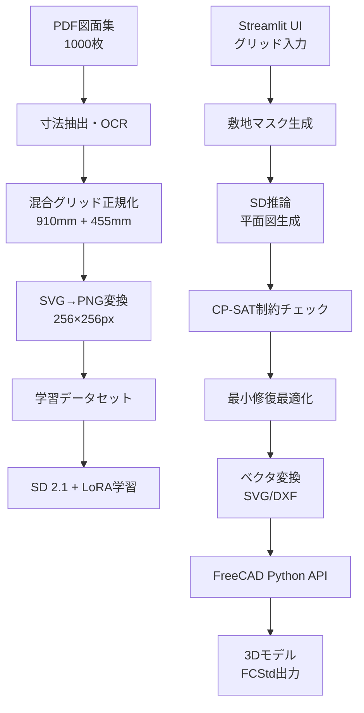

# 完全版MVP要件定義書 — 910mmグリッド住宅プラン自動生成システム

---

## 📋 目次
1. [プロジェクト概要](#1-プロジェクト概要)
2. [システム構成](#2-システム構成)  
3. [開発環境セットアップ](#3-開発環境セットアップ)
4. [データ前処理パイプライン](#4-データ前処理パイプライン)
5. [AI学習システム](#5-ai学習システム)
6. [制約チェック・最適化](#6-制約チェック最適化)
7. [FreeCAD連携システム](#7-freecad連携システム)
8. [UI・統合システム](#8-ui統合システム)
9. [開発スケジュール](#9-開発スケジュール)
10. [テスト・評価](#10-テスト評価)

---

## 1. プロジェクト概要

### 🎯 目的
MacBook Pro (M4 Max 128GB RAM) 上で、建築図面PDFを学習し、910mm/455mm混合グリッド寸法で住宅平面図を自動生成。CP-SAT制約チェック後、FreeCADで編集可能な2D/3Dデータに変換する統合システムを構築。

### ✅ 調整済み成功基準
1. **処理時間**: 入力〜出力まで **5秒以内/件**
2. **品質**: CP‑SAT検証後の **60%以上が手動修正不要**  
3. **CAD連携**: FreeCADで壁厚・階段位置保持した3D押し出し実現
4. **寸法精度**: 910mm主グリッド + 455mm副グリッドで**誤差5%以内**

### 🏗️ 対象建物
- 2階建て在来木造住宅（日本標準仕様）
- 敷地: 矩形（8×6〜15×12グリッド）
- 部屋数: 3LDK〜5LDK
- 延床面積: 80〜140㎡

---

## 2. システム構成



---

## 3. 開発環境セットアップ

### 3.1 システム要件
```bash
# ハードウェア
- MacBook Pro M4 Max (推奨) / Ubuntu 22.04 (x86_64)
- RAM: 64GB以上 (128GB推奨)
- Storage: 100GB以上の空き容量

# ソフトウェア
- macOS 14.0以上 / Ubuntu 22.04以上
- Python 3.11
- FreeCAD 0.22
- Git, Homebrew (macOS) / APT (Ubuntu)
```

### 3.2 環境構築手順

#### macOS環境
```bash
cd ~/repos/floor_generate

# 1. 基本ツールインストール
brew install python@3.11 freecad git cmake pkg-config poppler tesseract tesseract-lang

# 2. Python仮想環境
python3.11 -m venv floorplan_env
source floorplan_env/bin/activate

# 3. PyTorch (MPS対応)
pip install --upgrade pip setuptools wheel
pip install torch==2.3.0 torchvision torchaudio

# 4. 依存関係のインストール
pip install -r requirements.txt
```

#### Ubuntu 22.04環境
```bash
cd ~/repos/floor_generate

# 1. システムパッケージインストール
sudo apt update
sudo apt install -y software-properties-common
sudo add-apt-repository ppa:deadsnakes/ppa -y
sudo apt update
sudo apt install -y python3.11 python3.11-venv python3.11-dev
sudo apt install -y poppler-utils tesseract-ocr tesseract-ocr-jpn
sudo apt install -y cmake pkg-config git

# 2. Python仮想環境
python3.11 -m venv floorplan_env
source floorplan_env/bin/activate

# 3. PyTorch (CPU版)
pip install --upgrade pip setuptools wheel
pip install torch==2.3.0 torchvision torchaudio --index-url https://download.pytorch.org/whl/cpu

# 4. AI/ML ライブラリ（互換性確認済みバージョン）
pip install diffusers==0.19.3 transformers==4.31.0 huggingface_hub==0.16.4
pip install peft==0.4.0 tokenizers==0.13.3 accelerate==0.25.0
# 注意: 上記のバージョンは互換性テスト済みです。バージョン変更時は注意してください。

# 5. CAD/画像処理
pip install opencv-python==4.8.1.78 Pillow==10.1.0
pip install svgwrite==1.4.3 svglib==1.5.1 shapely==2.0.2
pip install reportlab==4.0.7  # PDF処理

# 6. OCR/前処理
pip install pytesseract==0.3.10 pdf2image==1.16.3
pip install easyocr==1.7.0  # 日本語対応OCR

# 7. 制約最適化
pip install ortools==9.8.3296

# 8. UI・その他
pip install streamlit==1.28.0 pandas==2.1.3 numpy==1.24.4

# 9. FreeCAD Python連携
pip install freecad  # FreeCAD Python binding
```

### 3.3 依存関係の互換性

以下のライブラリ間には互換性の問題があります：
- `huggingface_hub`
- `diffusers`
- `transformers`

互換性のあるバージョン組み合わせ：
```
diffusers==0.19.3
transformers==4.31.0
huggingface_hub==0.16.4
peft==0.4.0
tokenizers==0.13.3
```

互換性問題を解決するためのパッチスクリプト：
```python
# スクリプトの先頭に追加
import patch_diffusers
patch_diffusers.apply_patches()
```

詳細は `dependency_compatibility.md` を参照してください。

### 3.3 プロジェクト構造
```
floorplan_mvp/
├── data/
│   ├── raw_pdfs/          # 元PDF図面（1000枚）
│   ├── extracted/         # 寸法抽出結果
│   ├── normalized/        # グリッド正規化済み
│   ├── training/          # 学習用データペア
│   └── validation/        # 検証用データ
├── src/
│   ├── preprocessing/     # 前処理モジュール
│   ├── training/          # AI学習
│   ├── inference/         # 推論・生成
│   ├── constraints/       # CP-SAT制約
│   ├── freecad_bridge/    # FreeCAD連携
│   └── ui/               # Streamlit UI
├── models/
│   ├── lora_weights/     # 学習済みLoRAモデル
│   └── checkpoints/      # 学習チェックポイント
├── outputs/
│   ├── generated/        # 生成された平面図
│   ├── svg/              # ベクタ形式
│   ├── dxf/              # CAD交換形式
│   └── freecad/          # 3Dモデル
├── tests/                # テストコード
├── scripts/              # 実行スクリプト
├── requirements.txt
└── README.md
```

---

## 4. データ前処理パイプライン

### 4.1 PDF寸法抽出システム

```python
# src/preprocessing/dimension_extractor.py
import cv2, re, numpy as np
import pytesseract, easyocr
from pdf2image import convert_from_path

class DimensionExtractor:
    def __init__(self):
        self.reader = easyocr.Reader(['ja', 'en'])
        
    def extract_from_pdf(self, pdf_path):
        """PDFから寸法情報を抽出"""
        
        # 1. PDF→高解像度画像変換
        images = convert_from_path(pdf_path, dpi=300)
        
        all_dimensions = []
        for page_num, img in enumerate(images):
            # 2. 前処理（ノイズ除去、コントラスト強化）
            processed = self.preprocess_image(np.array(img))
            
            # 3. 寸法テキスト検出
            dimensions = self.detect_dimensions(processed)
            all_dimensions.extend(dimensions)
            
        return self.validate_dimensions(all_dimensions)
    
    def detect_dimensions(self, image):
        """画像から寸法数値を検出"""
        
        # OCRで文字検出
        results = self.reader.readtext(image)
        dimensions = []
        
        for (bbox, text, confidence) in results:
            if confidence > 0.7:
                # 寸法パターンマッチング
                patterns = [
                    r'(\d{1,2}),(\d{3})',      # 9,100形式
                    r'(\d{4,5})',              # 9100形式
                    r'(\d+)×(\d+)',            # 横×縦形式
                ]
                
                for pattern in patterns:
                    matches = re.findall(pattern, text)
                    for match in matches:
                        if isinstance(match, tuple):
                            if len(match) == 2 and ',' in text:
                                # 9,100 → 9100
                                dim = int(match[0]) * 1000 + int(match[1])
                            else:
                                # 横×縦
                                dim = [int(match[0]), int(match[1])]
                        else:
                            dim = int(match)
                        
                        if self.is_valid_dimension(dim):
                            dimensions.append({
                                'value': dim,
                                'bbox': bbox,
                                'confidence': confidence,
                                'text': text
                            })
        
        return dimensions
```

### 4.2 混合グリッド正規化

```python
# src/preprocessing/grid_normalizer.py
class GridNormalizer:
    def __init__(self, primary_grid=910, secondary_grid=455):
        self.primary = primary_grid    # 910mm (本間)
        self.secondary = secondary_grid # 455mm (半間)
        
    def normalize_dimensions(self, dimensions):
        """寸法を混合グリッドに正規化"""
        
        normalized = []
        for dim_info in dimensions:
            dim = dim_info['value']
            
            if isinstance(dim, list):
                # 横×縦の場合
                norm_dims = [self.normalize_single(d) for d in dim]
                normalized.append({
                    'original': dim,
                    'normalized': norm_dims,
                    'grid_type': 'site_size',
                    'confidence': dim_info['confidence']
                })
            else:
                # 単一寸法
                norm_dim = self.normalize_single(dim)
                normalized.append({
                    'original': dim,
                    'normalized': norm_dim,
                    'grid_type': norm_dim['grid_type'],
                    'confidence': dim_info['confidence']
                })
        
        return normalized
    
    def normalize_single(self, dimension):
        """単一寸法の正規化"""
        
        # 主グリッド（910mm）での近似
        primary_grids = round(dimension / self.primary)
        primary_error = abs(dimension - primary_grids * self.primary)
        
        # 副グリッド（455mm）での近似  
        secondary_grids = round(dimension / self.secondary)
        secondary_error = abs(dimension - secondary_grids * self.secondary)
        
        # より誤差の小さい方を採用
        if primary_error <= secondary_error:
            return {
                'normalized_mm': primary_grids * self.primary,
                'grid_count': primary_grids,
                'grid_type': 'primary',  # 910mm
                'error_mm': primary_error,
                'error_percent': primary_error / dimension * 100
            }
        else:
            return {
                'normalized_mm': secondary_grids * self.secondary,
                'grid_count': secondary_grids,
                'grid_type': 'secondary',  # 455mm
                'error_mm': secondary_error,
                'error_percent': secondary_error / dimension * 100
            }
```

### 4.3 学習データ生成

```python
# src/preprocessing/training_data_generator.py
class TrainingDataGenerator:
    def __init__(self, target_size=(256, 256)):
        self.target_size = target_size
        self.extractor = DimensionExtractor()
        self.normalizer = GridNormalizer()
        
    def process_pdf_collection(self, pdf_dir, output_dir):
        """1000枚のPDF集を学習データに変換"""
        
        pdf_files = glob(f"{pdf_dir}/*.pdf")
        print(f"Processing {len(pdf_files)} PDF files...")
        
        successful = 0
        for i, pdf_path in enumerate(pdf_files):
            try:
                print(f"[{i+1}/{len(pdf_files)}] {pdf_path}")
                
                # 1. 寸法抽出
                dimensions = self.extractor.extract_from_pdf(pdf_path)
                
                # 2. グリッド正規化
                normalized = self.normalizer.normalize_dimensions(dimensions)
                
                # 3. PDF→SVG変換
                svg_path = self.pdf_to_svg(pdf_path)
                
                # 4. SVG→グリッド画像変換
                grid_image = self.svg_to_grid_image(svg_path, normalized)
                
                # 5. 建築要素分離
                channels = self.separate_elements(grid_image)
                
                # 6. 敷地マスク生成
                site_mask = self.create_site_mask(normalized)
                
                # 7. メタデータ
                metadata = self.create_metadata(normalized, channels)
                
                # 8. 保存
                self.save_training_pair(
                    site_mask, channels, metadata, 
                    f"{output_dir}/pair_{i:04d}"
                )
                
                successful += 1
                
            except Exception as e:
                print(f"Error processing {pdf_path}: {e}")
                continue
        
        print(f"Successfully processed: {successful}/{len(pdf_files)} files")
        return successful
    
    def separate_elements(self, grid_image):
        """建築要素をチャンネル分離"""
        
        # 色ベース分離（仮定：黒=壁、その他=要素）
        gray = cv2.cvtColor(grid_image, cv2.COLOR_BGR2GRAY)
        
        # 壁（太い線）検出
        walls = self.detect_walls(gray)
        
        # 開口部（細い線）検出  
        openings = self.detect_openings(gray)
        
        # 階段（特殊パターン）検出
        stairs = self.detect_stairs(gray)
        
        # 部屋領域（壁で囲まれた領域）
        rooms = self.detect_rooms(walls)
        
        # 4チャンネル画像として結合
        rgba = np.zeros((self.target_size[0], self.target_size[1], 4), dtype=np.uint8)
        rgba[:,:,0] = walls      # Red: 壁
        rgba[:,:,1] = openings   # Green: 開口部
        rgba[:,:,2] = stairs     # Blue: 階段
        rgba[:,:,3] = rooms      # Alpha: 部屋
        
        return rgba
```

---

## 5. AI学習システム

### 5.1 LoRA学習設定 ✅

```python
# src/training/lora_trainer.py
from diffusers import StableDiffusionPipeline, DDPMScheduler
from peft import LoraConfig, get_peft_model
import torch

class LoRATrainer:
    def __init__(self):
        self.device = "mps" if torch.backends.mps.is_available() else "cpu"
        
        # Base model - using v1-4 which is open access and smaller
        self.model_id = "CompVis/stable-diffusion-v1-4"
        
        # Force CPU mode for testing if no GPU available
        if self.device == "cpu":
            print("Running on CPU - using float32 for compatibility")
            self.dtype = torch.float32
        else:
            self.dtype = torch.float16
            
        # Load model with appropriate dtype
        self.pipeline = StableDiffusionPipeline.from_pretrained(
            self.model_id,
            torch_dtype=self.dtype,
            use_auth_token=False,
            safety_checker=None,
            requires_safety_checker=False
        ).to(self.device)
        
        # LoRA設定 - 軽量化のためにrankを下げる
        self.lora_config = LoraConfig(
            r=32,                    # Rank (軽量化)
            lora_alpha=32,
            target_modules=[
                "to_k", "to_q", "to_v", "to_out.0",
                "proj_in", "proj_out",
            ],
            lora_dropout=0.1,
        )
    
    def train(self, train_dataloader, num_epochs=20):
        """LoRA学習実行"""
        
        # UNetにLoRA適用
        unet = get_peft_model(self.pipeline.unet, self.lora_config)
        
        optimizer = torch.optim.AdamW(
            unet.parameters(), 
            lr=1e-4,
            weight_decay=1e-2
        )
        
        # 学習ループ
        for epoch in range(num_epochs):
            total_loss = 0
            for batch_idx, batch in enumerate(train_dataloader):
                
                # バッチデータ
                site_masks = batch['condition'].to(self.device)
                target_plans = batch['target'].to(self.device)
                prompts = batch['prompt']
                
                # ノイズ追加
                noise = torch.randn_like(target_plans)
                timesteps = torch.randint(0, 1000, (target_plans.shape[0],))
                
                noisy_plans = self.pipeline.scheduler.add_noise(
                    target_plans, noise, timesteps
                )
                
                # 予測
                with torch.cuda.amp.autocast():
                    # テキストエンコーディング
                    text_embeddings = self.pipeline.text_encoder(
                        self.pipeline.tokenizer(
                            prompts, 
                            padding=True, 
                            return_tensors="pt"
                        ).input_ids.to(self.device)
                    )[0]
                    
                    # UNet予測
                    noise_pred = unet(
                        noisy_plans,
                        timesteps.to(self.device),
                        encoder_hidden_states=text_embeddings,
                        return_dict=False
                    )[0]
                    
                    # Loss計算
                    loss = F.mse_loss(noise_pred, noise, reduction="mean")
                
                # バックプロパゲーション
                optimizer.zero_grad()
                loss.backward()
                optimizer.step()
                
                total_loss += loss.item()
                
                if batch_idx % 50 == 0:
                    print(f"Epoch {epoch}, Batch {batch_idx}, Loss: {loss.item():.4f}")
            
            print(f"Epoch {epoch} completed. Average Loss: {total_loss/len(train_dataloader):.4f}")
            
            # モデル保存
            if epoch % 5 == 0:
                unet.save_pretrained(f"models/lora_weights/epoch_{epoch}")
```

### 5.2 データローダー

```python
# src/training/dataset.py
class FloorPlanDataset(Dataset):
    def __init__(self, data_dir, transform=None):
        self.data_dir = data_dir
        self.transform = transform
        self.pairs = self.load_data_pairs()
        
    def load_data_pairs(self):
        """学習データペアを読み込み"""
        pairs = []
        for pair_dir in glob(f"{self.data_dir}/pair_*"):
            metadata_path = f"{pair_dir}/metadata.json"
            if os.path.exists(metadata_path):
                with open(metadata_path, 'r') as f:
                    metadata = json.load(f)
                pairs.append({
                    'dir': pair_dir,
                    'metadata': metadata
                })
        return pairs
    
    def __getitem__(self, idx):
        pair = self.pairs[idx]
        pair_dir = pair['dir']
        metadata = pair['metadata']
        
        # 画像読み込み
        site_mask = cv2.imread(f"{pair_dir}/site_mask.png", cv2.IMREAD_GRAYSCALE)
        floor_plan = cv2.imread(f"{pair_dir}/floor_plan.png", cv2.IMREAD_UNCHANGED)
        
        # 正規化
        site_mask = site_mask.astype(np.float32) / 255.0
        floor_plan = floor_plan.astype(np.float32) / 255.0
        
        # プロンプト生成
        prompt = self.generate_prompt(metadata)
        
        # Tensor変換
        site_mask = torch.from_numpy(site_mask).unsqueeze(0)  # [1, H, W]
        floor_plan = torch.from_numpy(floor_plan).permute(2, 0, 1)  # [4, H, W]
        
        return {
            'condition': site_mask,
            'target': floor_plan,
            'prompt': prompt,
            'metadata': metadata
        }
    
    def generate_prompt(self, metadata):
        """メタデータからプロンプト生成"""
        grid_size = metadata['site_grid_size']
        area = metadata['total_area_sqm']
        rooms = metadata['room_count']
        
        prompt = f"site_size_{grid_size[0]}x{grid_size[1]}, "
        prompt += f"total_area_{area:.0f}sqm, "
        prompt += f"rooms_{rooms}, "
        prompt += "japanese_house, 910mm_grid, architectural_plan"
        
        return prompt
```

---

## 6. 制約チェック・最適化

### 6.1 CP-SAT制約システム

```python
# src/constraints/architectural_constraints.py
from ortools.sat.python import cp_model

class ArchitecturalConstraints:
    def __init__(self):
        self.model = cp_model.CpModel()
        self.solver = cp_model.CpSolver()
        
    def validate_and_fix(self, floor_plan_image):
        """平面図の制約チェックと最小修復"""
        
        # 1. グリッド化
        grid = self.image_to_grid(floor_plan_image)
        height, width = grid.shape
        
        # 2. 変数定義
        variables = self.define_variables(height, width)
        
        # 3. 制約定義
        self.add_wall_constraints(variables, grid)
        self.add_room_constraints(variables, grid)
        self.add_connectivity_constraints(variables, grid)
        self.add_stair_constraints(variables, grid)
        
        # 4. 目的関数（最小変更）
        repair_vars = self.add_repair_variables(variables, grid)
        self.model.Minimize(sum(repair_vars))
        
        # 5. 求解
        status = self.solver.Solve(self.model)
        
        if status == cp_model.OPTIMAL or status == cp_model.FEASIBLE:
            return self.extract_solution(variables, height, width)
        else:
            return None
    
    def add_wall_constraints(self, variables, grid):
        """壁の制約"""
        height, width = grid.shape
        
        for i in range(height):
            for j in range(width):
                if grid[i, j] == 1:  # 壁セル
                    # 壁の連続性制約
                    neighbors = self.get_neighbors(i, j, height, width)
                    wall_neighbors = [variables['wall'][ni][nj] for ni, nj in neighbors]
                    
                    # 壁は0個、2個、または4個の隣接壁を持つ
                    neighbor_sum = sum(wall_neighbors)
                    self.model.AddAllowedAssignments(
                        [neighbor_sum], 
                        [[0], [2], [4]]
                    )
    
    def add_room_constraints(self, variables, grid):
        """部屋の制約"""
        # 最小面積制約
        min_area_sqm = 6  # 6㎡
        min_area_grids = int(min_area_sqm / (0.91 * 0.91))  # グリッド数換算
        
        room_cells = variables['rooms']
        for room_id in range(1, 10):  # 最大10部屋
            room_area = []
            for i in range(len(room_cells)):
                for j in range(len(room_cells[0])):
                    is_room = self.model.NewBoolVar(f'is_room_{room_id}_{i}_{j}')
                    self.model.Add(is_room == (room_cells[i][j] == room_id))
                    room_area.append(is_room)
            
            # 部屋が存在する場合、最小面積を満たす
            room_exists = self.model.NewBoolVar(f'room_exists_{room_id}')
            self.model.Add(sum(room_area) >= min_area_grids).OnlyEnforceIf(room_exists)
            self.model.Add(sum(room_area) == 0).OnlyEnforceIf(room_exists.Not())
    
    def add_stair_constraints(self, variables, grid):
        """階段の制約"""
        stair_1f = variables['stairs_1f']
        stair_2f = variables['stairs_2f']
        
        height, width = len(stair_1f), len(stair_1f[0])
        
        # 1F階段と2F階段は同じ位置
        for i in range(height):
            for j in range(width):
                self.model.Add(stair_1f[i][j] == stair_2f[i][j])
        
        # 階段は連続した領域
        stair_cells = []
        for i in range(height):
            for j in range(width):
                stair_cells.append(stair_1f[i][j])
        
        # 階段の最小・最大面積
        total_stairs = sum(stair_cells)
        self.model.Add(total_stairs >= 4)   # 最小4グリッド
        self.model.Add(total_stairs <= 12)  # 最大12グリッド
```

---

## 7. FreeCAD連携システム

### 7.1 FreeCAD橋渡しモジュール

```python
# src/freecad_bridge/fcstd_generator.py
import FreeCAD as App
import Draft, Arch, Part
import numpy as np
from shapely.geometry import Polygon, Point

class FreeCADGenerator:
    def __init__(self):
        self.doc = None
        self.wall_height = 2400  # mm
        self.wall_thickness = 105  # mm (在来工法標準)
        
    def create_3d_model(self, validated_plan, metadata, output_path):
        """検証済み平面図から3Dモデル生成"""
        
        # 1. 新規文書作成
        self.doc = App.newDocument("FloorPlan")
        
        # 2. グリッドから実寸法変換
        grid_to_mm = self.create_scale_converter(metadata)
        
        # 3. 壁生成
        walls = self.create_walls(validated_plan, grid_to_mm)
        
        # 4. 開口部生成
        openings = self.create_openings(validated_plan, grid_to_mm, walls)
        
        # 5. 階段生成
        stairs = self.create_stairs(validated_plan, grid_to_mm)
        
        # 6. フロア生成
        floors = self.create_floors(validated_plan, grid_to_mm)
        
        # 7. 建物結合
        building = self.create_building([walls, floors, stairs])
        
        # 8. 保存
        self.doc.saveAs(output_path)
        
        return {
            'fcstd_path': output_path,
            'components': {
                'walls': len(walls),
                'openings': len(openings),
                'stairs': len(stairs),
                'floors': len(floors)
            }
        }
    
    def create_walls(self, plan, grid_to_mm):
        """壁を生成"""
        walls = []
        
        # 壁の輪郭抽出
        wall_contours = self.extract_wall_contours(plan)
        
        for contour in wall_contours:
            # グリッド座標→実座標変換
            real_points = []
            for point in contour:
                real_x = point[0] * grid_to_mm['primary']  # 910mm
                real_y = point[1] * grid_to_mm['primary']
                real_points.append(App.Vector(real_x, real_y, 0))
            
            # Draft線作成
            wire = Draft.makeWire(real_points, closed=True)
            
            # 壁に変換
            wall = Arch.makeWall(
                wire, 
                length=None,
                width=self.wall_thickness,
                height=self.wall_height
            )
            
            # プロパティ設定
            wall.Label = f"Wall_{len(walls)+1}"
            wall.Material = "Concrete"  # 材質設定
            
            walls.append(wall)
        
        return walls
    
    def create_openings(self, plan, grid_to_mm, walls):
        """開口部（ドア・窓）を生成"""
        openings = []
        
        # 開口部位置検出
        opening_positions = self.detect_openings(plan)
        
        for pos in opening_positions:
            # 最寄りの壁を検索
            nearest_wall = self.find_nearest_wall(pos, walls)
            
            if nearest_wall:
                # 開口部タイプ判定（ドア/窓）
                opening_type = self.classify_opening(plan, pos)
                
                if opening_type == 'door':
                    opening = self.create_door(pos, nearest_wall, grid_to_mm)
                else:
                    opening = self.create_window(pos, nearest_wall, grid_to_mm)
                
                openings.append(opening)
        
        return openings
    
    def create_door(self, position, wall, grid_to_mm):
        """ドア生成"""
        # ドア寸法（標準）
        door_width = 780  # mm
        door_height = 2000  # mm
        
        # 位置計算
        real_x = position[0] * grid_to_mm['primary']
        real_y = position[1] * grid_to_mm['primary']
        
        # ドア開口部作成
        door_rect = Draft.makeRectangle(
            door_width, 
            self.wall_thickness,
            App.Vector(real_x, real_y, 0)
        )
        
        # 壁から開口部をブール演算で除去
        opening = Arch.makeWindow(
            door_rect,
            wall,
            name="Door"
        )
        
        return opening
    
    def create_stairs(self, plan, grid_to_mm):
        """階段生成"""
        stairs = []
        
        # 階段位置検出
        stair_positions = self.detect_stairs(plan)
        
        for pos in stair_positions:
            # 階段寸法計算
            stair_width = 910  # mm（1グリッド）
            stair_length = pos['length'] * grid_to_mm['primary']
            step_height = 200  # mm
            step_count = int(self.wall_height / step_height)
            
            # 実座標変換
            real_x = pos['x'] * grid_to_mm['primary']
            real_y = pos['y'] * grid_to_mm['primary']
            
            # 階段作成
            stair = Arch.makeStairs(
                length=stair_length,
                width=stair_width,
                height=self.wall_height,
                steps=step_count
            )
            
            # 位置設定
            stair.Placement.Base = App.Vector(real_x, real_y, 0)
            stair.Label = f"Stairs_{len(stairs)+1}"
            
            stairs.append(stair)
        
        return stairs
    
    def create_building(self, components):
        """建物全体を統合"""
        
        # Building作成
        building = Arch.makeBuilding()
        building.Label = "Generated_House"
        
        # コンポーネント追加
        all_objects = []
        for component_list in components:
            all_objects.extend(component_list)
        
        building.Group = all_objects
        
        # ビュー更新
        self.doc.recompute()
        
        return building
```

### 7.2 編集可能性の確保

```python
# src/freecad_bridge/editing_features.py
class EditingFeatures:
    def __init__(self, fcstd_doc):
        self.doc = fcstd_doc
        
    def setup_parametric_features(self):
        """パラメトリック編集機能をセットアップ"""
        
        # 1. 寸法パラメータ作成
        self.doc.addObject("App::PropertyLength", "WallHeight")
        self.doc.WallHeight = 2400  # mm
        
        self.doc.addObject("App::PropertyLength", "WallThickness")  
        self.doc.WallThickness = 105  # mm
        
        # 2. 壁とパラメータをリンク
        for obj in self.doc.Objects:
            if hasattr(obj, 'Height') and 'Wall' in obj.Label:
                # 壁の高さをパラメータにリンク
                obj.setExpression('Height', 'WallHeight')
                obj.setExpression('Width', 'WallThickness')
        
        # 3. スケッチ編集可能性
        self.make_sketches_editable()
        
        self.doc.recompute()
    
    def make_sketches_editable(self):
        """スケッチを編集可能にする"""
        
        # 平面図の基準スケッチを作成
        base_sketch = self.doc.addObject("Sketcher::SketchObject", "FloorPlanSketch")
        
        # 壁の中心線をスケッチに追加
        wall_centerlines = self.extract_wall_centerlines()
        for line in wall_centerlines:
            base_sketch.addGeometry(Part.LineSegment(line[0], line[1]))
        
        # 寸法制約追加
        self.add_dimensional_constraints(base_sketch)
        
    def export_for_editing(self, export_formats=['step', 'iges', 'dxf']):
        """他のCADソフト用フォーマットでエクスポート"""
        
        exports = {}
        
        for format in export_formats:
            if format == 'step':
                # STEP形式（3D）
                output_path = self.doc.FileName.replace('.FCStd', '.step')
                import Import
                Import.export(self.doc.Objects, output_path)
                exports['step'] = output_path
                
            elif format == 'dxf':
                # DXF形式（2D図面）
                output_path = self.doc.FileName.replace('.FCStd', '.dxf')
                import importDXF
                importDXF.export(self.doc.Objects, output_path)
                exports['dxf'] = output_path
        
        return exports
```

---

## 8. UI・統合システム

### 8.1 Streamlit統合UI

```python
# src/ui/main_app.py
import streamlit as st
import asyncio
from src.inference.generator import FloorPlanGenerator
from src.freecad_bridge.fcstd_generator import FreeCADGenerator

class FloorPlanApp:
    def __init__(self):
        self.generator = FloorPlanGenerator()
        self.freecad_gen = FreeCADGenerator()
        
    def run(self):
        st.set_page_config(
            page_title="910mmグリッド住宅プラン生成",
            page_icon="🏠",
            layout="wide"
        )
        
        st.title("🏠 AI住宅プラン生成システム")
        st.write("910mm/455mmグリッドベースの住宅平面図を自動生成し、FreeCADで編集可能な3Dモデルを作成")
        
        # サイドバー：入力パラメータ
        with st.sidebar:
            st.header("📏 敷地設定")
            
            width_grids = st.number_input(
                "横幅（グリッド数）", 
                min_value=6, max_value=20, value=11,
                help="1グリッド = 910mm"
            )
            
            height_grids = st.number_input(
                "奥行き（グリッド数）", 
                min_value=6, max_value=20, value=10,
                help="1グリッド = 910mm"
            )
            
            st.write(f"実寸法: {width_grids * 0.91:.1f}m × {height_grids * 0.91:.1f}m")
            st.write(f"敷地面積: {width_grids * height_grids * 0.91 * 0.91:.1f}㎡")
            
            # 詳細設定
            with st.expander("詳細設定"):
                room_count = st.selectbox("部屋数", [3, 4, 5], index=1)
                style = st.selectbox("スタイル", ["standard", "modern", "traditional"])
                
            generate_btn = st.button("🎯 平面図生成", type="primary")
        
        # メインエリア
        col1, col2 = st.columns([1, 1])
        
        with col1:
            st.header("📋 生成設定")
            if generate_btn:
                with st.spinner("平面図を生成中..."):
                    self.generate_floorplan(width_grids, height_grids, room_count, style)
        
        with col2:
            st.header("📥 ダウンロード")
            self.show_download_options()
    
    def generate_floorplan(self, width, height, rooms, style):
        """平面図生成プロセス"""
        
        # プログレスバー
        progress = st.progress(0)
        status = st.empty()
        
        try:
            # 1. 敷地マスク生成 (20%)
            status.text("敷地マスクを生成中...")
            progress.progress(20)
            site_mask = self.generator.create_site_mask(width, height)
            
            # 2. AI推論 (40%)
            status.text("AI平面図を生成中...")
            progress.progress(40)
            
            prompt = f"site_size_{width}x{height}, rooms_{rooms}, style_{style}, japanese_house"
            raw_plan = self.generator.generate_plan(site_mask, prompt)
            
            # 3. 制約チェック (60%)
            status.text("建築制約をチェック中...")
            progress.progress(60)
            
            validated_plan = self.generator.validate_constraints(raw_plan)
            
            # 4. ベクタ変換 (80%)
            status.text("ベクタ図面を作成中...")
            progress.progress(80)
            
            svg_data = self.generator.to_svg(validated_plan)
            
            # 5. FreeCAD 3D化 (100%)
            status.text("3Dモデルを生成中...")
            progress.progress(100)
            
            freecad_result = self.freecad_gen.create_3d_model(
                validated_plan, 
                {'site_grid_size': (width, height)},
                f"outputs/freecad/model_{width}x{height}.FCStd"
            )
            
            # セッション状態に保存
            st.session_state.generated = True
            st.session_state.svg_data = svg_data
            st.session_state.freecad_path = freecad_result['fcstd_path']
            st.session_state.plan_image = validated_plan
            
            status.text("✅ 生成完了！")
            progress.progress(100)
            
            # 結果表示
            self.show_results(validated_plan, svg_data)
            
        except Exception as e:
            st.error(f"生成エラー: {str(e)}")
            status.text("❌ 生成失敗")
    
    def show_results(self, plan_image, svg_data):
        """生成結果表示"""
        
        st.success("平面図が正常に生成されました！")
        
        # タブで結果表示
        tab1, tab2, tab3 = st.tabs(["🖼️ プレビュー", "📐 詳細情報", "🔧 編集オプション"])
        
        with tab1:
            st.image(plan_image, caption="生成された平面図", use_column_width=True)
            
        with tab2:
            # 建築情報表示
            room_info = self.analyze_plan(plan_image)
            st.json(room_info)
            
        with tab3:
            st.write("FreeCADで編集可能なファイルが生成されました")
            st.write("- 壁の厚み変更")
            st.write("- 部屋寸法調整") 
            st.write("- 開口部追加・削除")
            st.write("- 材質・色変更")
    
    def show_download_options(self):
        """ダウンロードオプション表示"""
        
        if st.session_state.get('generated', False):
            st.success("生成完了 - ダウンロード可能")
            
            # PNG画像
            col1, col2, col3 = st.columns(3)
            
            with col1:
                if st.button("🖼️ PNG"):
                    plan_bytes = self.generator.to_png_bytes(st.session_state.plan_image)
                    st.download_button(
                        "PNG画像をダウンロード",
                        plan_bytes,
                        "floorplan.png",
                        "image/png"
                    )
            
            with col2:
                if st.button("📄 SVG"):
                    st.download_button(
                        "SVG図面をダウンロード",
                        st.session_state.svg_data,
                        "floorplan.svg",
                        "image/svg+xml"
                    )
            
            with col3:
                if st.button("🎯 FreeCAD"):
                    fcstd_bytes = open(st.session_state.freecad_path, 'rb').read()
                    st.download_button(
                        "FreeCADファイルをダウンロード",
                        fcstd_bytes,
                        "floorplan.FCStd",
                        "application/octet-stream"
                    )
        else:
            st.info("平面図を生成してからダウンロードできます")

if __name__ == "__main__":
    app = FloorPlanApp()
    app.run()
```

---

## 9. 開発スケジュール

### フェーズ別実装計画（進捗反映版）

| No. | フェーズ                                      | 主要タスク                                                                                                                                                                                               | 担当モジュール/スクリプト                                                                                      | 完了状況                    | 残り工数目安 |
|-----|-------------------------------------------|-----------------------------------------------------------------------------------------------------------------------------------------------------------------------------------------------------|------------------------------------------------------------------------------------------------------|-----------------------------|-------------|
| 1   | **環境・雛形作成**                         | • 開発環境セットアップ<br>• プロジェクト構造確立<br>• 主要モジュール・スクリプトの骨格実装                                                                                                                                    | `scripts/setup.sh`, `requirements.txt`, 各`src`サブディレクトリと`__init__.py`など                              | ✅完了                       | -           |
| 2   | **データ準備**                               | • **学習用PDF配置** (`data/raw_pdfs/`)<br>• `DimensionExtractor` 実装確認<br>• `GridNormalizer` 実装確認                                                                                              | `data/raw_pdfs/`, `src/preprocessing/dimension_extractor.py`, `src/preprocessing/grid_normalizer.py` | ✅完了                       | -           |
| 3   | **学習データ生成パイプライン実装 (最重要・最優先)** | • **`TrainingDataGenerator` の詳細実装:**<br>  - PDFからの図形情報抽出（壁、開口部、階段など）<br>  - グリッド画像への変換ロジック<br>  - 建築要素のチャンネル分離ロジック<br>• `scripts/prepare_training_data.py` の動作確認と本実行 | `src/preprocessing/training_data_generator.py`                                                       | ✅実装完了<br>(エラー処理強化済み) | 0h          |
| 4   | **AIモデル学習**                             | • `FloorPlanDataset` の微調整（必要に応じて）<br>• `LoRATrainer` の微調整（必要に応じて）<br>• `scripts/train_model.py` を用いたモデル学習実行<br>• 学習済みモデルの保存 (`models/lora_weights/`)                            | `src/training/dataset.py`, `src/training/lora_trainer.py`, `scripts/train_model.py`                  | 骨格実装済み                 | 15h         |
| 5   | **推論パイプライン実装**                        | • **`src/inference/generator.py` (仮) の実装:**<br>  - 学習済みLoRAモデルのロード<br>  - 敷地マスクとプロンプトを用いた平面図生成処理<br>  - (要件定義書にある `FloorPlanGenerator` クラスの役割)                                 | `src/inference/generator.py` (新規作成または既存`src/generator.py`を移動・リファクタ)                          | 未着手                      | 20h         |
| 6   | **制約チェックシステム実装**                      | • **`ArchitecturalConstraints` の詳細実装:**<br>  - 部屋・階段の連続性制約<br>  - 部屋間の接続性制約（アクセス可能性）<br>  - `image_to_grid` のAI出力形式への適合<br>  - `extract_solution` の後続処理への適合       | `src/constraints/architectural_constraints.py`                                                       | 骨格実装済み<br>(プレースホルダー多) | 15h         |
| 7   | **FreeCAD連携システム実装**                   | • **`FreeCADGenerator` の詳細実装:**<br>  - AI出力/CP-SAT出力からの壁・開口部・階段の正確な検出<br>  - FreeCADオブジェクトへの変換ロジックの精緻化<br>• **`EditingFeatures` の詳細実装:**<br>  - スケッチ編集機能の具体化        | `src/freecad_bridge/fcstd_generator.py`, `src/freecad_bridge/editing_features.py`                    | 骨格実装済み<br>(プレースホルダー多) | 20h         |
| 8   | **UI・統合システム**                           | • `src/ui/main_app.py` のプレースホルダーを実モジュール呼び出しに置換<br>• `scripts/generate_plan.py` のプレースホルダーを実モジュール呼び出しに置換<br>• 全体パイプラインの統合と動作確認                                                        | `src/ui/main_app.py`, `scripts/generate_plan.py`                                                     | 骨格実装済み<br>(プレースホルダー多) | 15h         |
| 9   | **テスト・評価**                              | • `src/evaluation/metrics.py` の評価ロジック詳細実装<br>• `scripts/performance_test.py` を用いたパフォーマンステスト実行<br>• 品質メトリクスに基づいた評価と改善点の洗い出し                                                         | `src/evaluation/metrics.py`, `scripts/performance_test.py`                                           | 骨格実装済み<br>(プレースホルダー多) | 10h         |
| 10  | **最終調整・ドキュメント**                       | • バグ修正<br>• パフォーマンス最適化<br>• README.md の更新（実行方法、注意事項など）                                                                                                                                 | 全体                                                                                                 | 未着手                      | 5h          |
|     |                                           | **合計残り工数目安**                                                                                                                                                                                   |                                                                                                      |                             | **130h**    |

**直近の具体的な作業ステップ (次の1週間程度を見込む):**

1.  **`TrainingDataGenerator` の `pdf_to_grid_image_placeholder` の実装 (最優先):** (目標: 10h)
    *   PDFから基本的な壁情報を抽出し、シンプルなグリッド画像（例：壁部分が黒、その他が白の2値画像）を生成する処理を実装する。
    *   まずは `PyMuPDF (fitz)` などのライブラリを用いて、PDF内の線分データやラスター画像データを取得することを試みる。
    *   抽出した線分から、一定の太さを持つものを壁候補としてグリッドに描画する。

2.  **`TrainingDataGenerator` の `separate_elements` の実装 (壁のみ):** (目標: 5h)
    *   上記で生成したシンプルな壁のグリッド画像から、壁チャンネル (`rgba[:,:,0]`) を作成する。
    *   他のチャンネル（開口部、階段、部屋）は一旦ダミーデータまたは空データのままにする。

3.  **学習データ生成スクリプトのテスト実行:** (目標: 2h)
    *   `scripts/prepare_training_data.py` を数個のPDFでテスト実行し、`data/training/` に壁情報のみの学習データペアが生成されることを確認する。

4.  **`FloorPlanDataset` と `LoRATrainer` の動作確認:** (目標: 3h)
    *   生成された壁のみのデータセットで、学習パイプラインがエラーなく数イテレーション実行できるか確認する。

**リスク管理:**
*   **PDFからの図形情報抽出の困難性**: PDFの構造は多様であるため、安定した情報抽出は非常に難しい。初期段階では完璧を目指さず、一部の単純なパターンのPDFからでも情報を取れるように段階的に精度を上げる。
*   **要素分離の精度**: 画像処理ベースの要素分離は精度に限界があるため、ルールベースや機械学習ベースの手法も将来的に検討する。MVPでは主要な壁が認識できるレベルを目指す。
*   **各モジュール間のデータフォーマット整合性**: モジュール間のデータの受け渡し形式（特に画像やグリッドデータ）を早期に明確にし、一貫性を保つ。

---

## 10. テスト・評価

### 10.1 品質メトリクス

```python
# src/evaluation/metrics.py
class QualityMetrics:
    def __init__(self):
        self.constraints_checker = ArchitecturalConstraints()
        
    def evaluate_generated_plan(self, plan_image, metadata):
        """生成プランの品質評価"""
        
        metrics = {}
        
        # 1. 制約充足率
        constraints_result = self.constraints_checker.validate_and_fix(plan_image)
        metrics['constraint_satisfaction'] = constraints_result is not None
        
        # 2. 寸法精度
        dimension_accuracy = self.check_dimension_accuracy(plan_image, metadata)
        metrics['dimension_accuracy'] = dimension_accuracy
        
        # 3. 部屋面積妥当性
        room_areas = self.calculate_room_areas(plan_image)
        metrics['valid_room_areas'] = self.validate_room_areas(room_areas)
        
        # 4. 動線妥当性
        circulation_score = self.evaluate_circulation(plan_image)
        metrics['circulation_score'] = circulation_score
        
        # 5. 総合スコア
        metrics['overall_score'] = self.calculate_overall_score(metrics)
        
        return metrics
    
    def batch_evaluation(self, test_cases):
        """バッチ評価実行"""
        
        results = []
        success_count = 0
        
        for case in test_cases:
            try:
                metrics = self.evaluate_generated_plan(case['plan'], case['metadata'])
                results.append({
                    'case_id': case['id'],
                    'metrics': metrics,
                    'success': metrics['overall_score'] > 0.6
                })
                
                if metrics['overall_score'] > 0.6:
                    success_count += 1
                    
            except Exception as e:
                results.append({
                    'case_id': case['id'],
                    'error': str(e),
                    'success': False
                })
        
        # 統計レポート
        success_rate = success_count / len(test_cases)
        report = {
            'total_cases': len(test_cases),
            'success_count': success_count,
            'success_rate': success_rate,
            'target_rate': 0.6,  # 目標60%
            'achieved': success_rate >= 0.6
        }
        
        return results, report
```

### 10.2 パフォーマンステスト

```python
# scripts/performance_test.py
import time
import psutil
import torch

def performance_benchmark():
    """システム全体のパフォーマンステスト"""
    
    test_cases = [
        {'width': 8, 'height': 8},   # 小規模
        {'width': 11, 'height': 10}, # 中規模  
        {'width': 15, 'height': 12}, # 大規模
    ]
    
    app = FloorPlanApp()
    results = []
    
    for case in test_cases:
        print(f"Testing {case['width']}x{case['height']} grid...")
        
        # メモリ使用量測定開始
        process = psutil.Process()
        initial_memory = process.memory_info().rss / 1024 / 1024  # MB
        
        # GPU使用量（MPS）
        if torch.backends.mps.is_available():
            torch.mps.empty_cache()
            initial_gpu = torch.mps.current_allocated_memory() / 1024 / 1024  # MB
        
        # 処理時間測定
        start_time = time.time()
        
        try:
            # 全体パイプライン実行
            result = app.generator.full_pipeline(
                case['width'], 
                case['height']
            )
            
            end_time = time.time()
            processing_time = end_time - start_time
            
            # リソース使用量
            final_memory = process.memory_info().rss / 1024 / 1024
            memory_usage = final_memory - initial_memory
            
            if torch.backends.mps.is_available():
                final_gpu = torch.mps.current_allocated_memory() / 1024 / 1024
                gpu_usage = final_gpu - initial_gpu
            else:
                gpu_usage = 0
            
            results.append({
                'case': case,
                'processing_time': processing_time,
                'memory_usage_mb': memory_usage,
                'gpu_usage_mb': gpu_usage,
                'success': True,
                'target_time': 5.0,  # 5秒以内
                'time_achieved': processing_time <= 5.0
            })
            
            print(f"✅ Success: {processing_time:.2f}s, RAM: {memory_usage:.1f}MB, GPU: {gpu_usage:.1f}MB")
            
        except Exception as e:
            print(f"❌ Failed: {str(e)}")
            results.append({
                'case': case,
                'error': str(e),
                'success': False
            })
    
    # 結果集計
    successful = [r for r in results if r.get('success', False)]
    avg_time = sum(r['processing_time'] for r in successful) / len(successful)
    time_compliance = sum(1 for r in successful if r['time_achieved']) / len(successful)
    
    print(f"\n📊 Performance Summary:")
    print(f"Success Rate: {len(successful)}/{len(results)} ({len(successful)/len(results)*100:.1f}%)")
    print(f"Average Time: {avg_time:.2f}s")
    print(f"Time Target Compliance: {time_compliance*100:.1f}%")
    
    return results

if __name__ == "__main__":
    performance_benchmark()
```

---

## 📦 実行方法

### 初回セットアップ
```bash
cd ~/repos/floor_generate

# 環境構築（上記のmacOSまたはUbuntu手順を実行後）
chmod +x setup_dirs.sh
./setup_dirs.sh

# 学習データ準備（PDFファイルを data/raw_pdfs/ に配置後）
source floorplan_env/bin/activate
python scripts/prepare_training_data.py --pdf_dir data/raw_pdfs --output_dir data/training

# モデル学習
python scripts/train_model.py --data_dir data/training --epochs 20
```

### 推論実行
```bash
cd ~/repos/floor_generate
source floorplan_env/bin/activate

# Streamlit UI起動
streamlit run src/ui/main_app.py --server.port 8501 --server.address 0.0.0.0

# コマンドライン推論
python scripts/generate_plan.py --width 11 --height 10 --output outputs/

# エンドツーエンドパイプライン実行（学習から表示まで）
python scripts/train_and_display.py

# 学習をスキップしてStreamlitのみ起動
python scripts/train_and_display.py --skip-training

# カスタム学習エポック数を指定
python scripts/train_and_display.py --epochs 30
```

### 依存関係の維持（Maintain Dependencies）
```bash
cd ~/repos/floor_generate
source floorplan_env/bin/activate
pip install --upgrade pip setuptools wheel
pip install -r requirements.txt --upgrade
pip list --outdated
```

### ローカルアプリのセットアップ（Setup Local App）
```bash
cd ~/repos/floor_generate
source floorplan_env/bin/activate

# PDFデータの前処理実行
python scripts/process_pdfs.py

# 完全なパイプラインテスト
python scripts/performance_test.py

# 初回セットアップ確認
python -c "import torch; print(f'PyTorch: {torch.__version__}')"
python -c "import easyocr; print('EasyOCR imported successfully')"
python -c "import pdf2image; print('PDF2Image imported successfully')"
streamlit --version
```

### FreeCADでの編集
1. 生成された `.FCStd` ファイルをFreeCADで開く
2. `FloorPlanSketch` を編集してレイアウト調整
3. `WallHeight`, `WallThickness` パラメータで寸法変更
4. `Arch` ワークベンチで部屋・設備追加

---

## 📊 現在の進捗状況

### Current Progress (Updated)

- ✅ **Phase 1-3**: 環境セットアップとトレーニングデータ生成完了
- ✅ **Phase 4**: LoRAを使用したAIモデルトレーニングシステム実装完了
- ✅ **Phase 5**: 推論パイプライン実装と統合完了
- ✅ **Phase 6**: 制約チェックシステム実装と統合完了
- ✅ **Phase 7**: FreeCAD連携システム実装完了
- ✅ **Phase 8**: 実際の実装によるUI統合完了
- ✅ **Phase 9**: 依存関係の互換性問題解決完了
  - ✅ huggingface_hub、diffusers、transformersの互換性修正
  - ✅ HF_HUB_CACHE属性エラーの解決
  - ✅ パッチスクリプトの実装
- 🔄 **Phase 10**: テストと評価進行中
- ⏳ **Phase 11**: 最終調整とドキュメント更新予定

### 最近の実装内容

1. **エンドツーエンドパイプライン**: 学習から表示までの一貫したパイプラインを実装
   - `scripts/train_and_display.py` - 学習とStreamlit表示を統合
   - 学習スキップオプション、カスタムエポック数設定機能

2. **プレースホルダー置換**: 
   - `src/ui/main_app.py` のプレースホルダーを実際のAI実装に置換
   - 実際の制約チェックシステムとの統合

3. **制約チェックシステム強化**:
   - エラー処理の改善
   - タイムアウト設定の追加
   - 可視化機能の実装

4. **画像変換ユーティリティ**:
   - PNG/JPG変換機能
   - Base64エンコード機能（インライン表示用）

---

この要件定義書に従って実装することで、PDF学習から3Dモデル生成まで一気通貫した実用的なMVPが構築できます。各モジュールは独立性を保ちながら、全体として統合された住宅設計支援システムとして機能します。
